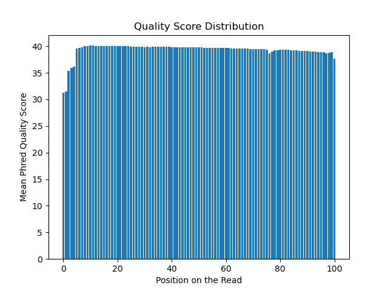

# Assignment the First

## Part 1
1. Be sure to upload your Python script. Provide a link to it here:
https://github.com/sgolubeva/Demultiplex/blob/master/Assignment-the-first/initial_data_exploration.py

| File name | label | Read length | Phred encoding |
|---|---|---|---|
| 1294_S1_L008_R1_001.fastq.gz | histR1.png |101  | Phred+33  |
| 1294_S1_L008_R2_001.fastq.gz | histR2.png | 8 | Phred+33 |
| 1294_S1_L008_R3_001.fastq.gz | histR3.png | 8 | Phred+33 |
| 1294_S1_L008_R4_001.fastq.gz | histR4.png | 101 | Phred+33 |

2. Per-base NT distribution
    
    R1 histogram
   
    2. 
    3. https://github.com/sgolubeva/Demultiplex/blob/master/Assignment-the-first/histR2.png
    4. https://github.com/sgolubeva/Demultiplex/blob/master/Assignment-the-first/histR3.png
    5. https://github.com/sgolubeva/Demultiplex/blob/master/Assignment-the-first/histR4.png
       
    
## Part 2
1. Define the problem
2. Describe output
3. Upload your [4 input FASTQ files](../TEST-input_FASTQ) and your [>=6 expected output FASTQ files](../TEST-output_FASTQ).
4. Pseudocode
5. High level functions. For each function, be sure to include:
    1. Description/doc string
    2. Function headers (name and parameters)
    3. Test examples for individual functions
    4. Return statement
